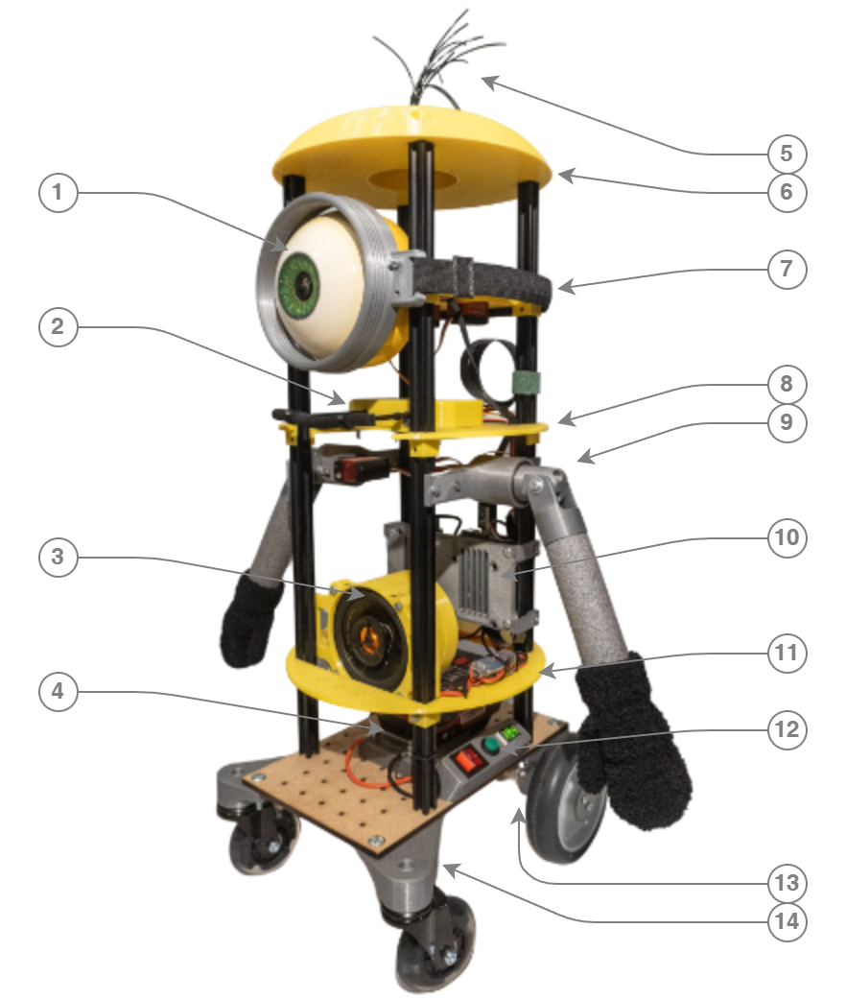
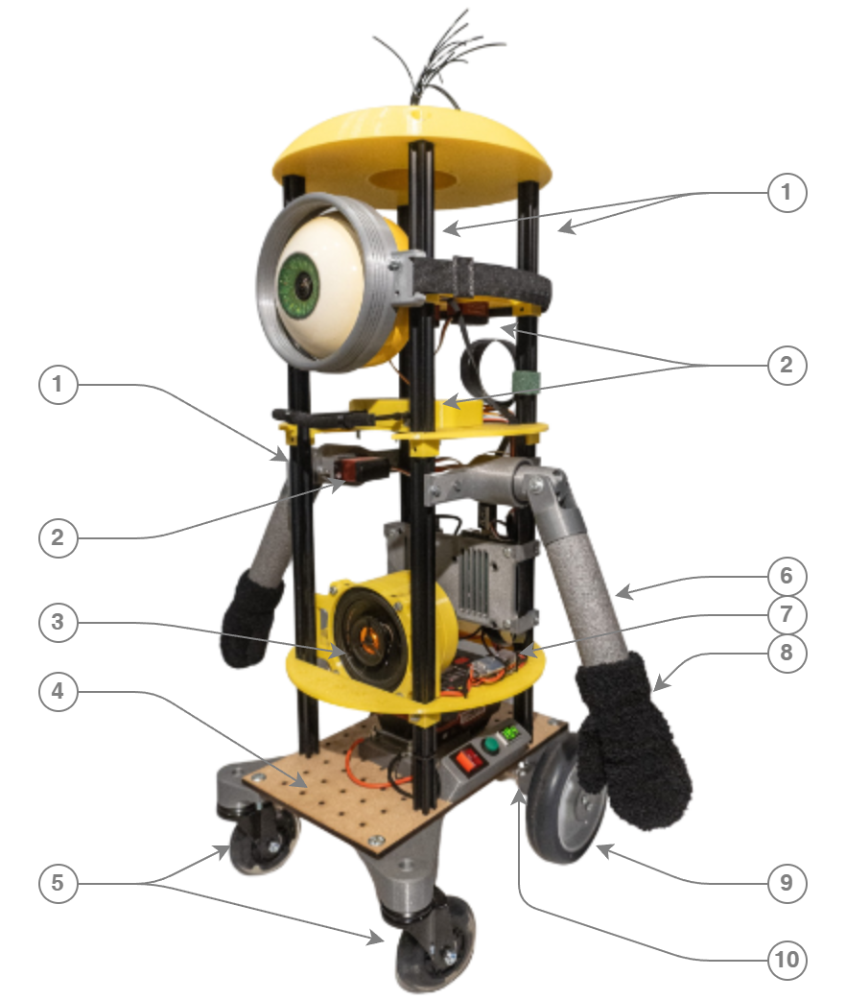
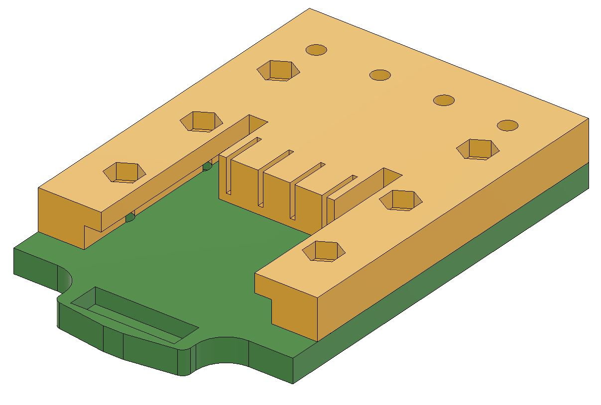
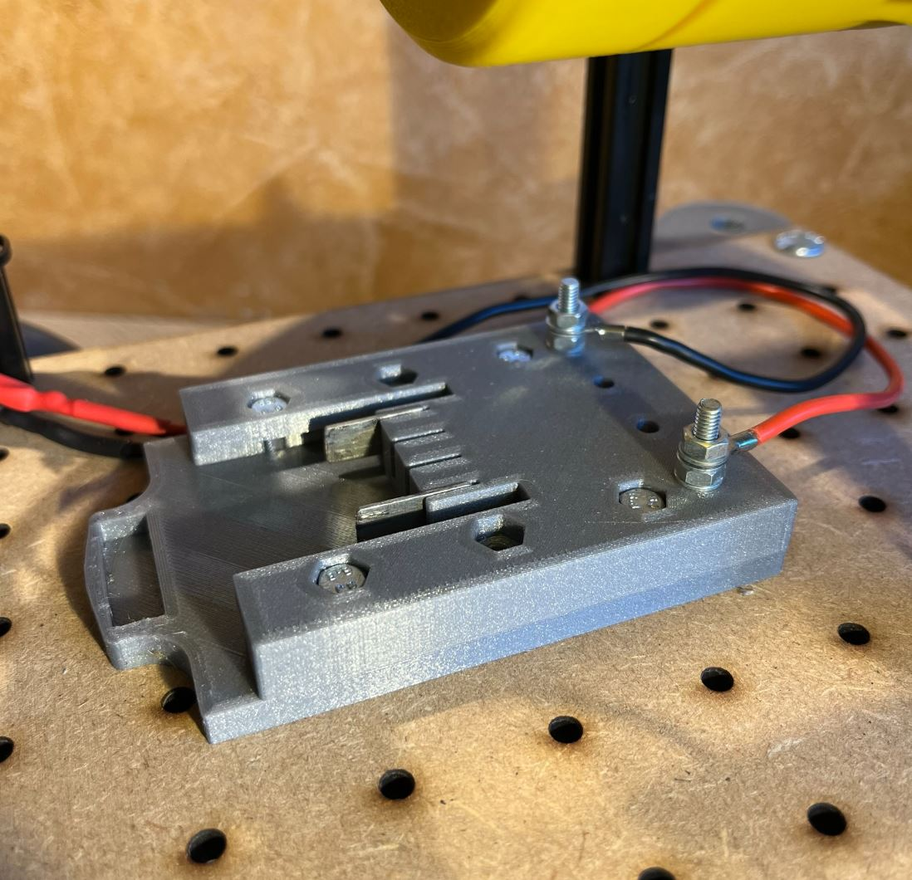
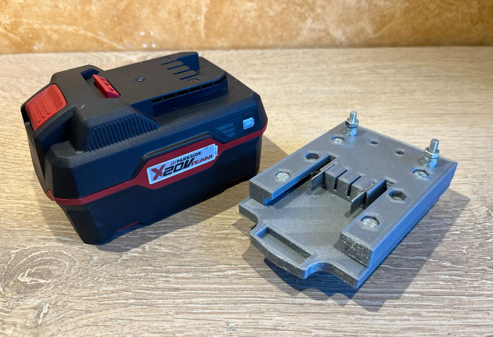
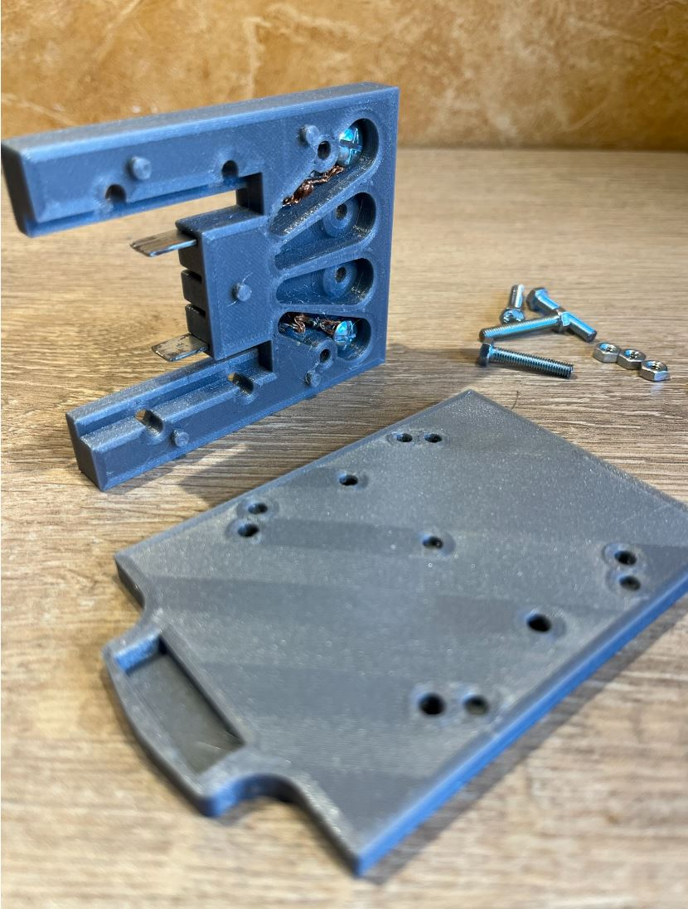
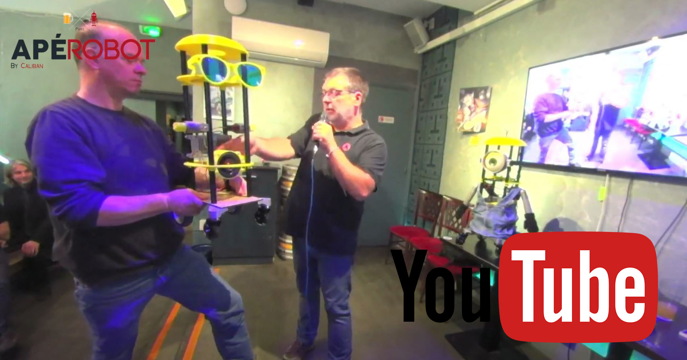

# Projet Robot MINION
***intro***

---
### Liste des pièces
***Pièces réalisées en impression 3D***

<table  width="100%"><tbody>
<tr>
   <td width="60%"></td>
   <td align="left">
   1 - L'<strong>oeil</strong> (voir plus bas) et la <a href="3D_STL/Lunette.stl">lunette</a> 
   2 - La <strong>bouche</strong> (voir plus bas) 
   3 - Haut parleur(*) et son <a href="3D_STL/HP_box.stl">support</a> 
   4 - <strong>Batterie</strong> et sa base d'acceuil (voir plus bas) 
   5 - <strong>Cheveux</strong> avec quelques bouts de TPU 
   6 - <a href="3D_STL/Chapeau.stl">Chapeau</a> & Couvercles 
   7 - <a href="3D_STL/Plateau_oeil_v2.stl">Plateau_oeil</a> 
   8 - <a href="3D_STL/Plateau_2.stl">Plateau 2</a> 
   9 - L'<strong>épaule</strong> (voir plus bas) 
   10 - <a href="3D_STL/Support_RPI.stl">Support Raspberry PI</a> 
   11 - <a href="3D_STL/Plateau_3.stl">Plateau 3</a> 
   12 - Boutons de commande sur <a href="3D_STL/Power_button.stl">support</a>  
   13 - <a href="3D_STL/Support_D37.stl">Supports de moteur</a> 
   14 - Support de roues libres <a href="3D_STL/Support_Roue_Libre_R.stl">droite</a> et  <a href="3D_STL/Support_Roue_Libre_L.stl">gauche</a> 
     

   </td>
 </tr>
</tbody></table>

- Fichiers STL pour l'impression 3D --> [3D_STL](3D_STL)
- Fichiers sources, au format Fusion 360 --> [3D_Fusion360](3D_Fusion360)

(*) Haut-parleurs NORAUTO SOUND HP-100X Coaxial ( <a href="https://www.norauto.fr/p/haut-parleurs-norauto-sound-hp-100x-coaxial-2166455.html">ici</a> )

***Autres Pièces***
<table  width="100%"><tbody>
<tr>
   <td width="60%"></td>
   <td align="left">
   1 - 4 profils en aluminium anodisé 1515 - 550mm de long https://fr.aliexpress.com/item/1005004071352633.html  

   2 - ligne 2 
   3 - ligne 3 

   6 - Regulateur UBEC 7A https://fr.aliexpress.com/item/32574612952.html  

   </td>
 </tr>
</tbody></table>

---

### L'oeil
---
### La bouche
---
### Le mécanisme de l'épaule

---
### Le support de batterie
***Liens & info*** :
- Batterie Parkside PAP 20 B3 - 20 V 4000mAh 80wh
- Chargeur Parkside PLG 20 C3
- petites lamelles en cuivre étamées ( réalisé avec un vieux tube de cuivre de plomberie )
- quelques vis M4

***Fichiers 3D*** :
- [Support_Batterie_up.stl](3D_STL/Support_Batterie_up.stl)
- [Support_Batterie_down.stl](3D_STL/Support_Batterie_down.stl)
- source : [Support_Batterie_Parkside.f3d](3D_Fusion360/)

| ||
|-----|-----|

|  |  |  |
|-----|-----|-----|

---
## Présentation du projet lors de l'ApéroBot 0x90 - le 11 octobre 2023
 
https://youtu.be/tXXc-RWyAaM

Slides de présentation: [202310_Caliban_Robot_MINION.pptx](docs/202310_Caliban_Robot_MINION.pptx)

---
### Authors
Frederic JELMONI

### MIT License
Permission is hereby granted, free of charge, to any person obtaining a copy
of this software and associated documentation files (the "Software"), to deal
in the Software without restriction, including without limitation the rights
to use, copy, modify, merge, publish, distribute, sublicense, and/or sell
copies of the Software, and to permit persons to whom the Software is
furnished to do so, subject to the following conditions:

The above copyright notice and this permission notice shall be included in all
copies or substantial portions of the Software.

THE SOFTWARE IS PROVIDED "AS IS", WITHOUT WARRANTY OF ANY KIND, EXPRESS OR
IMPLIED, INCLUDING BUT NOT LIMITED TO THE WARRANTIES OF MERCHANTABILITY,
FITNESS FOR A PARTICULAR PURPOSE AND NONINFRINGEMENT. IN NO EVENT SHALL THE
AUTHORS OR COPYRIGHT HOLDERS BE LIABLE FOR ANY CLAIM, DAMAGES OR OTHER
LIABILITY, WHETHER IN AN ACTION OF CONTRACT, TORT OR OTHERWISE, ARISING FROM,
OUT OF OR IN CONNECTION WITH THE SOFTWARE OR THE USE OR OTHER DEALINGS IN THE
SOFTWARE.

### Copyright
Copyright (c) 2023 Frederic JELMONI
