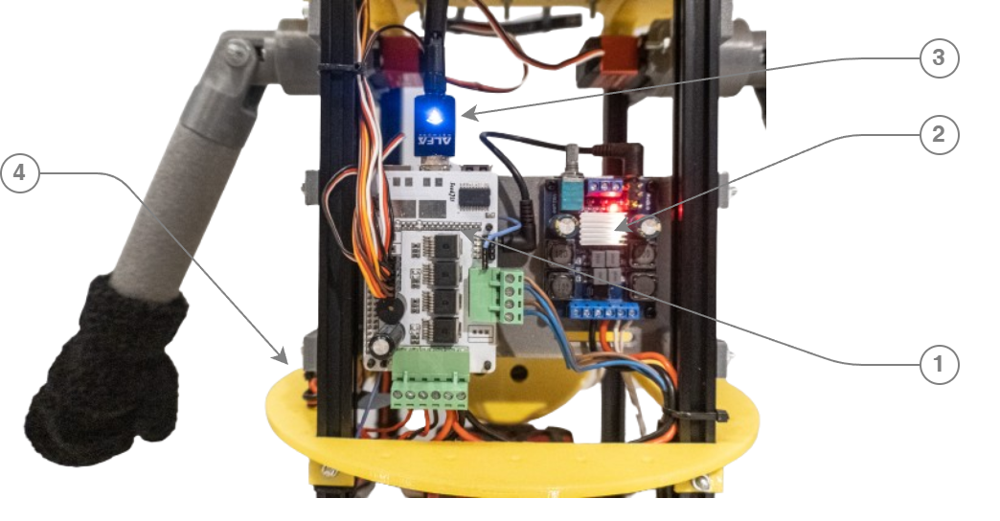

# Projet Robot MINION
### intro

L'objectif de ce projet est de concevoir et de réaliser un petit robot sympa, attractif, mignon, … un **MINION** !  

Mais plus généralement, l’objectif de ce projet est de réaliser les bases d’**une plateforme robotique d’étude**, offrant quelques caractéristique et fonctionnalités intéressantes :

* **Robuste** , solide
   * châssis en fibre de bois médium qui être également réalisé en aluminium
   * pièces principales en impression 3D
* **Modulable**
   * utilisation de profilés aluminium permettant de fixer les plateaux ou les accessoires à différentes hauteurs
   * matrice de trous pré percés lors de la réalisation du châssis permettant ainsi de positionner librement les différentes évolutions
   * ensemble des pièces 3D disponible pour éventuellement être modifiées, adaptées  
* **Spacieuse**
   * 54 cm séparent le châssis inférieur et le bas bas du chapeau ,
   * les profilés alu verticaux sont espacés de 150mm
   * ce qui donne un volume utile intérieur de 15x15x54 cm , mais certain éléments peuvent être positionnés sur l’extérieur (comme les bras, par exemple)

* **Puissante**
   * mécaniquement par l’utilisation de 2 moteurs CC à fort couple , qui pourront être remplacé par des modèles plus puissant  si besoin

* **Programmable** et **connectée**
   * Une carte Raspberry PI 4 au coeur du robot ( pouvant évoluer vers une version 5)
   * modules USB WiFi ou 4/5G
   * développement en Python (ou autre langage)
   * synthèse et reconnaissance vocal
   * traitement et tracking vidéo , computer vision

* **Evolutive**
   * bien évidemment, on pourra greffer à souhait un certain nombre de capteurs, actionneurs, ou autres systèmes électroniques
   * l’objectif est bien évidemment de faire évoluer les éléments du robot , bras, tête, motricité …

Le robot, dans cette version, mesure environ 70cm de haut, le chapeau supérieur et les plateaux ont un diamètre de 250mm, l'empattement des roues est d’environ 300mm .

<table  width="100%"><tbody>
<tr>
<td align="center" width="50%"></td>
<td align="center" width="30%">https://youtube.com/shorts/Kb3ByDOdsDA</td>

</tr>
</tbody></table>   

### Sommaire
* Les pièces pièces réalisées en impression 3D
* Les autres pièces
* L'oeil
* La bouche
* Le mécanisme de l'épaule
* Le support de batterie
* L'électronique de commande
* Présentation du projet lors de l'ApéroBot 0x90 - le 11 octobre 2023
* Le projet MINION au JT de France 3 Pays De La Loire

---

## Les pièces pièces réalisées en impression 3D

<table  width="100%"><tbody>
<tr>
   <td width="60%"></td>
   <td align="left">
   (1) - L'<strong>oeil</strong> (voir plus bas) et la <a href="3D_STL/Lunette.stl">lunette</a> 
   (2) - La <strong>bouche</strong> (voir plus bas) 
   (3) - <a href="3D_STL/HP_box.stl">Support du haut parleur</a> 
   (4) - <strong>Batterie</strong> et sa base d'acceuil (voir plus bas) 
   (5) - <strong>Cheveux</strong> avec quelques bouts de TPU 
   (6) - <a href="3D_STL/Chapeau.stl">Chapeau</a> & Couvercles 
   (7) - <a href="3D_STL/Plateau_oeil_v2.stl">Plateau_oeil</a> 
   (8) - <a href="3D_STL/Plateau_2.stl">Plateau 2</a> 
   (9) - L'<strong>épaule</strong> (voir plus bas) 
   (10) - <a href="3D_STL/Support_RPI.stl">Support Raspberry PI</a> 
   (11) - <a href="3D_STL/Plateau_3.stl">Plateau 3</a> 
   (12) - Boutons de commande sur <a href="3D_STL/Power_button.stl">support</a>  
   (13) - <a href="3D_STL/Support_D37.stl">Supports de moteur</a> 
   (14) - Support de roues libres <a href="3D_STL/Support_Roue_Libre_R.stl">droite</a> et  <a href="3D_STL/Support_Roue_Libre_L.stl">gauche</a> 
     

   </td>
 </tr>
</tbody></table>

- Fichiers STL pour l'impression 3D --> [3D_STL](3D_STL)
- Fichiers sources, au format Fusion 360 --> [3D_Fusion360](3D_Fusion360)

---

## Les autres pièces

<table  width="100%"><tbody>
<tr>
   <td width="60%"></td>
   <td align="left">
   (1) - <strong>4 profils</strong> en aluminium anodisé 1515 - 550mm de long <a href="https://fr.aliexpress.com/item/1005004071352633.html">aliexpress.com...</a> 
   (2) - <strong>Servos moteurs</strong> numériques 30/35Kg.cm 180 degrés <a href="https://fr.aliexpress.com/item/32826867656.html">aliexpress.com...</a>  
   (3) - Haut-parleur 20 watts RMS (<a href="https://www.norauto.fr/p/haut-parleurs-norauto-sound-hp-100x-coaxial-2166455.html">norauto.fr...</a>)  
   (4) - <strong>Plateau</strong> de bois médium 6mm réalisé en découpe laser <a href="2D/Chassis_v4.svg">fichier svg</a> & dxf  
   (5) - <strong>Roulettes</strong> Luminescent Chaise Gamer <a href="https://www.amazon.fr/gp/product/B09N95T18G">amazon.fr...</a> 
   (6) - <strong>Bras</strong> en mousse (d'isolation thermique en plomberie) diam 35mm  
   (7) - <strong>Regulateur</strong> UBEC 7A <a href="https://fr.aliexpress.com/item/32574612952.html">aliexpress.com...</a>  
   (8) - Petits gants pour les <strong>mains</strong> <a href="https://www.amazon.fr/gp/product/B0B7MNNZBG">amazon.fr...</a>  
   (9) - <strong>Roues</strong> dim 125mm <a href="https://www.leroymerlin.fr/produits/quincaillerie/quincaillerie-du-meuble/roue-et-roulette/roulette-de-meuble/roue-fixe-sur-axe-diam-125-mm-82629474.html">leroymerlin.fr...</a> 
   (10) - <strong>Moteurs</strong> D37 CC à Brosses 12V 100 RPM 166 oz-in <a href="https://eu.robotshop.com/fr/products/12v-100rpm-166-oz-in-brushed-dc-motor">robotshop.com...</a> 

   </td>
 </tr>
</tbody></table>

---

## L'oeil

L'oeil est réalisé en impression 3D avec poncage, peinture, et protection à la résine époxy.  
Il est articulé en X et Y autour d'un axe monté sur roulement. 
Il embarque une camera pour la carte Raspberry PI

***L'oeil est composé de plusieurs pièces :***

- la sphere de diamètre 130mm - <a href="3D_STL/Oeil_130.stl">Oeil_130.stl</a>
- un support pour la caméra - <a href="3D_STL/Oeil_Support_Cam.stl">Oeil_Support_Cam.stl</a>
- le support de l'oeil - <a href="3D_STL/Oeil_Support.stl">Oeil_Support.stl</a>
- l'axe - <a href="3D_STL/Oeil_Axe.stl">Oeil_Axe.stl</a>
- le raccordement au plateau - <a href="3D_STL/Oeil_Raccord_Plateau.stl">Oeil_Raccord_Plateau.stl</a>

 

- 3 roulements 608ZZ 8x22x7 <a href="https://www.amazon.fr/Roulements-Bearings-Skateboard-Longboard-Waveboard/dp/B07S3SZZST">amazon.fr...</a>  
- une camera RPI grand angle 175° <a href="https://fr.aliexpress.com/item/32881466491.html">aliexpress.com...</a>  
- <strong>2 Servos moteurs</strong> numériques 30/35Kg.cm 180 degrés <a href="https://fr.aliexpress.com/item/32826867656.html">aliexpress.com...</a>  

<table width="100%">
<td align="center"></td>
</table>

- Piéces imprimées --> [3D_STL](3D_STL)
- Fichiers sources, au format Fusion 360 --> [3D_Fusion360](3D_Fusion360)

---
## La bouche

La bouche est réalisée avec 2 servos moteurs, quelques pièces imprimées, et un petit "boudin" de silicone

- Piéces imprimées
  - support pour les 2 moteurs --> [Bouche_1.stl](3D_STL/Bouche_1.stl)
  - 2 bras --> [Bouche_2.stl](3D_STL/Bouche_2.stl)
  - le couvercle --> [Bouche_Couvercle.stl](Bouche_Couvercle.stl)
- Fichiers sources, au format Fusion 360 --> [3D_Fusion360](3D_Fusion360)

<table width="100%">
<td align="center">
 -
 -

</td>
</table>

---
## Le mécanisme de l'épaule

L'épaule est réalisée en impression 3D avec un servo moteur 30/35Kg et 2 roulements

- <strong>Servos moteurs</strong> numériques 30/35Kg.cm 180 degrés <a href="https://fr.aliexpress.com/item/32826867656.html">aliexpress.com...</a>  
- <strong>Roulements</strong> 30x37x4mm  <a href="https://www.amazon.fr/gp/product/B09SCMJTPJ/ref=ppx_yo_dt_b_search_asin_title">amazon.fr...</a>  
- 3 piéces imprimées --> [3D_STL](3D_STL)
- Fichiers sources, au format Fusion 360 --> [3D_Fusion360](3D_Fusion360)

<table width="100%">
<tr> <td align="center"> </td> </tr>
</table>

---

## Le support de batterie
***Liens & info*** :
- Batterie Parkside PAP 20 B3 - 20 V 4000mAh 80wh
- Chargeur Parkside PLG 20 C3
- petites lamelles en cuivre étamées ( réalisé avec un vieux tube de cuivre de plomberie )
- quelques vis M4

***Fichiers 3D*** :
- [Support_Batterie_up.stl](3D_STL/Support_Batterie_up.stl)
- [Support_Batterie_down.stl](3D_STL/Support_Batterie_down.stl)
- source : [Support_Batterie_Parkside.f3d](3D_Fusion360/)

| ||
|-----|-----|

|  |  |  |
|-----|-----|-----|

---

## L'électronique de commande

L'électronique embarqué est composé principalement :
- d'une carte Raspberry PI et un HAT de commande moteur https://github.com/FredJ21/Raspberry_PI_MotorDriverHat#readme
- d'un amplificateur audio
- d'un module WiFi USB
- de 2 regulateurs 5V afin séparer l'alimentation du RPI et des servos moteurs

<table  width="100%"><tbody>
<tr>
   <td width="60%"></td>
   <td align="left">
   (1) - Une carte <strong>Raspberry PI</strong> 4 (ou 5 ! ) <a href="https://www.kubii.com/">www.kubii.com...</a> 
   (2) - Une carte d'amplificateur numérique <a href="https://www.amazon.fr/gp/product/B09PL6R1L7">amazon.fr...</a>  
   (3) - Une carte WiFi USB (<a href="https://www.amazon.fr/gp/product/B0752CTSGD">amazon.fr...</a>)  
   (4) - <strong>2 Régulateurs</strong> UBEC 7A <a href="https://fr.aliexpress.com/item/32574612952.html">aliexpress.com...</a>  

   </td>
 </tr>
</tbody></table>

***Schéma***

---

---

## Présentation du projet lors de l'ApéroBot 0x90 - le 11 octobre 2023
 
- https://youtu.be/tXXc-RWyAaM
- Slides de présentation: [202310_Caliban_Robot_MINION.pptx](https://docs.google.com/presentation/d/1i7fHR1yLxM-sZlLi-bkuZh3kFmp7REDd2zA3NFKi7cQ/)

---

## Le projet MINION au JT de France 3 Pays De La Loire
- JT du 7 Juillet 2023 - Nantes Maker Campus 2023

 
- https://youtu.be/sHJWs27naQQ

---

### Authors
Frederic JELMONI

### MIT License
Permission is hereby granted, free of charge, to any person obtaining a copy
of this software and associated documentation files (the "Software"), to deal
in the Software without restriction, including without limitation the rights
to use, copy, modify, merge, publish, distribute, sublicense, and/or sell
copies of the Software, and to permit persons to whom the Software is
furnished to do so, subject to the following conditions:

The above copyright notice and this permission notice shall be included in all
copies or substantial portions of the Software.

THE SOFTWARE IS PROVIDED "AS IS", WITHOUT WARRANTY OF ANY KIND, EXPRESS OR
IMPLIED, INCLUDING BUT NOT LIMITED TO THE WARRANTIES OF MERCHANTABILITY,
FITNESS FOR A PARTICULAR PURPOSE AND NONINFRINGEMENT. IN NO EVENT SHALL THE
AUTHORS OR COPYRIGHT HOLDERS BE LIABLE FOR ANY CLAIM, DAMAGES OR OTHER
LIABILITY, WHETHER IN AN ACTION OF CONTRACT, TORT OR OTHERWISE, ARISING FROM,
OUT OF OR IN CONNECTION WITH THE SOFTWARE OR THE USE OR OTHER DEALINGS IN THE
SOFTWARE.

### Copyright
Copyright (c) 2023 Frederic JELMONI
